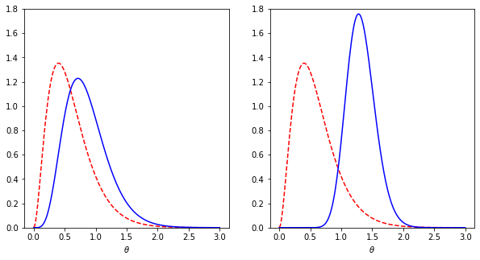
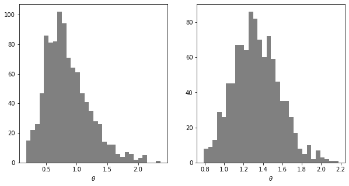

```python
import numpy as np
import matplotlib.pyplot as plt
from scipy.stats import gamma
%matplotlib inline
```

### Prior and posterior distributions


```python
# Create a grid
nx = 200
x = np.linspace(0, 3, nx)

# Prior
alpha, beta = 3, 5
prior_den = gamma.pdf(x, a = alpha, scale = 1/beta)

# Posteriors
x1, y1 = 2, 3
x2, y2 = 20, 30
post_den1 = gamma.pdf(x, alpha+y1, scale = 1/(beta+x1))
post_den2 = gamma.pdf(x, alpha+y2, scale = 1/(beta+x2))

# Plot
fig, (ax1,ax2) = plt.subplots(nrows=1, ncols=2, figsize=(10,5))
ax1.plot(x, prior_den, 'r--', x, post_den1, 'b-',)
ax1.set_ylim([0, 1.8])
ax1.set_xlabel(r'$\theta$');
ax2.plot(x, prior_den, 'r--', x, post_den2, 'b-')
ax2.set_ylim([0, 1.8])
ax2.set_xlabel(r'$\theta$');

```





### Random samples from posterior distributions


```python
n = 1000
theta_sample1 = gamma.rvs(a=alpha+y1, scale = 1/(beta+x1), size=n)
theta_sample2 = gamma.rvs(a=alpha+y2, scale = 1/(beta+x2), size=n)

fig, (ax1,ax2) = plt.subplots(nrows=1, ncols=2, figsize=(10,5))
ax1.hist(theta_sample1, bins=30, color='grey')
ax1.set_xlabel(r'$\theta$');
ax2.hist(theta_sample2, bins=30, color='grey')
ax2.set_xlabel(r'$\theta$');
```




